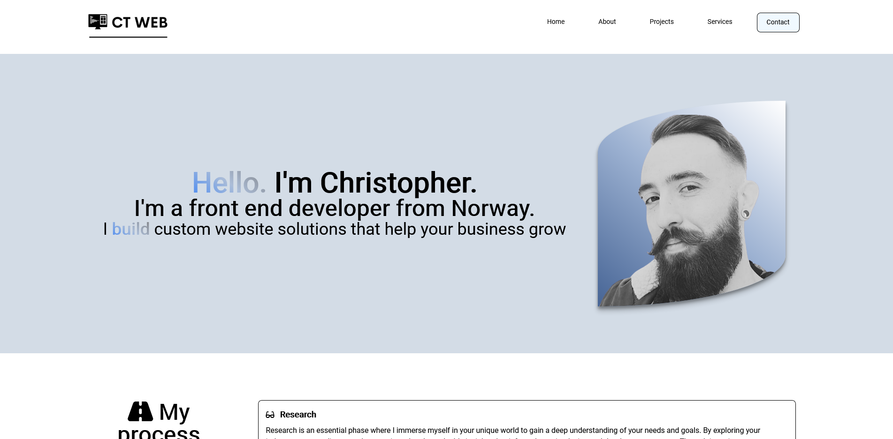

# Personal Portfolio



[Live site](https://christopher-tonnesland-portfolio.netlify.app/)

## Table of context

- [Introduction](#introduction)
- [Installation](#installation)
  - [Prerequisites](#prerequisites)
  - [Installation Steps](#installation-steps)
  - [Available Scripts](#available-scripts)

- [Author](#author)

## Introduction


## Installation

This guide will help you get started with running the This project locally.
Please follow the steps below:

#### Prerequisites

Before you begin, ensure that you have the following software installed on your machine:

- Node.js (version 14 or later)
- npm (Node Package Manager)

#### Installation Steps

1. Clone the repository to your local machine using Git or download the source code as a ZIP file and extract it.

2. Open a terminal or command prompt and navigate to the project directory.

3. Install the project dependencies by running the following command:

```bash
npm install
```

This command will install all the dependencies specified in the package.json file.

4. Once the dependencies are installed and the environment variables are set, you can start the development server by running the following command:

```bash
npm run dev
```

This command will start the development server and the application will be accessible at <http://localhost:5173/>.

5. Open your web browser and visit <http://localhost:5173/> to see the running React application.

#### Available Scripts

In the project directory, you can use the following npm scripts:

- `npm run dev`: "vite dev"
- `npm run build`: "vite build && npm run package"
- `npm run preview`: "vite preview"
- `npm run package`: "svelte-kit sync && svelte-package && publint"
- `npm run prepublishOnly`: "npm run package"
- `npm run check`: "svelte-kit sync && svelte-check --tsconfig ./jsconfig.json"
- `npm run check:watch`: "svelte-kit sync && svelte-check --tsconfig ./jsconfig.json --watch"
- `npm run lint`: "prettier --plugin-search-dir . --check . && eslint ."
- `npm run format`: "prettier --plugin-search-dir . --write ."
- `npm run deploy`: "npm run build && npx gh-pages -d build -t true"


That's it! You have successfully installed and started the React project locally. You can now explore and modify the code according to your needs.

If you encounter any issues during the installation process, please refer to the project's documentation or seek support from the project's maintainers.

## Author

<div style="display: flex; gap: 20px; align-items: center;">

<h3>Christopher Tønnesland</h3>
</div>
